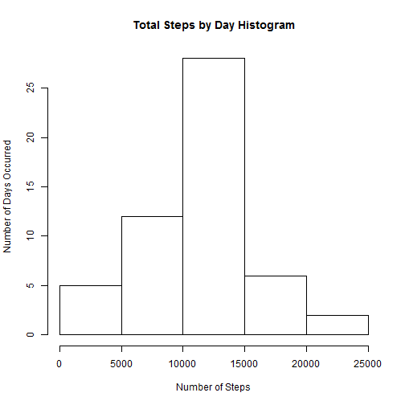
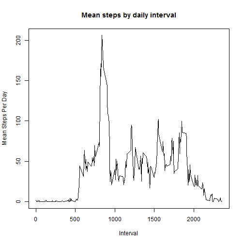
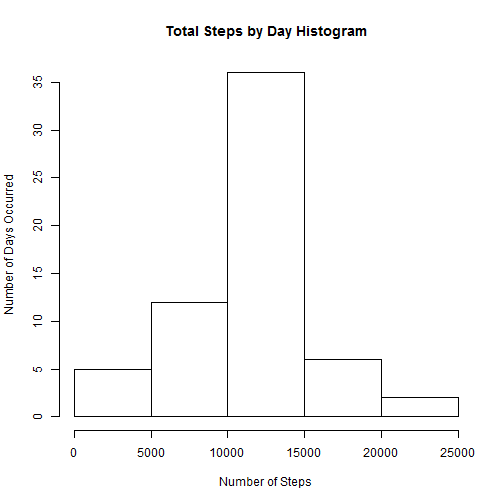
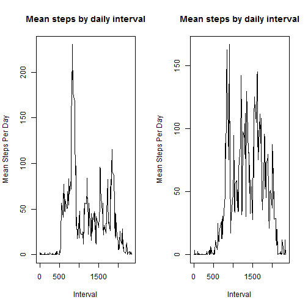

 

The following packages are used in my analysis:

```r
library(dplyr)
```

First we Read in the activity data and identify it's structure:

```r
activitydata<-read.csv("C:/RWork/Reprod_Research/repdata_data_activity/activity.csv")

str(activitydata)
```

```
## 'data.frame':	17568 obs. of  3 variables:
##  $ steps   : int  NA NA NA NA NA NA NA NA NA NA ...
##  $ date    : Factor w/ 61 levels "2012-10-01","2012-10-02",..: 1 1 1 1 1 1 1 1 1 1 ...
##  $ interval: int  0 5 10 15 20 25 30 35 40 45 ...
```


In the activity data, we find that there are NA (Missing Values in steps for some of the dates)

```r
nrow(activitydata[ is.na(activitydata$steps )==TRUE,] )
```

```
## [1] 2304
```

```r
print("We can see this in the summary of the data set as well")
```

```
## [1] "We can see this in the summary of the data set as well"
```

```r
summary(activitydata)
```

```
##      steps                date          interval     
##  Min.   :  0.00   2012-10-01:  288   Min.   :   0.0  
##  1st Qu.:  0.00   2012-10-02:  288   1st Qu.: 588.8  
##  Median :  0.00   2012-10-03:  288   Median :1177.5  
##  Mean   : 37.38   2012-10-04:  288   Mean   :1177.5  
##  3rd Qu.: 12.00   2012-10-05:  288   3rd Qu.:1766.2  
##  Max.   :806.00   2012-10-06:  288   Max.   :2355.0  
##  NA's   :2304     (Other)   :15840
```

We identified the following Dates have NA values


```r
bad_dates<-activitydata[is.na(activitydata$steps)==TRUE,]
data.frame(unique(bad_dates$date))
```

```
##   unique.bad_dates.date.
## 1             2012-10-01
## 2             2012-10-08
## 3             2012-11-01
## 4             2012-11-04
## 5             2012-11-09
## 6             2012-11-10
## 7             2012-11-14
## 8             2012-11-30
```

Question 1 is "What is the mean total steps per day?"

First remove the null steps values

```r
ad_clean<-activitydata[  is.na(activitydata$steps)==FALSE,]
```
Next, create a summarized data set by day

```r
s<-data.frame(tapply(ad_clean$steps, ad_clean$date, sum))
m<-data.frame(tapply(ad_clean$steps, ad_clean$date, mean))
s<-cbind(rownames(s), s)
agg_set<- cbind(s,m)
# Clean up column and row names
names(agg_set)<-c("date", "sum", "mean")
rownames(agg_set)<- c(1:61)
```

Remove NAs

```r
agg_set[ is.na(agg_set$sum)==FALSE,]-> nd
```


Create Histogram of Total Steps by Day

```r
hist(nd$sum, xlab="Number of Steps", ylab="Number of Days Occurred", main="Total Steps by Day Histogram")
```

 

Calculate the median of the total number of steps per day

```r
median(nd$sum)
```

```
## [1] 10765
```

Calculate the median and mean total number of steps per day

What is the average daily activity pattern?

```r
interval<-data.frame(tapply(ad_clean$steps, ad_clean$interval, mean))
names(interval)<-"meansteps"
#create plot
plot(x=rownames(interval), y=interval$meansteps, type = "l", xlab="Interval", ylab="Mean Steps Per Day", main="Mean steps by daily interval")
```

 

```r
# need to add the interval for merging and ensure that it is the same data type as activity data
interval<- cbind(as.integer(rownames(interval)), interval)
names(interval)<- c("interval", "meansteps")
```


Which five-minute interval contains the maximum steps?

```r
names(interval[interval$meansteps== max(interval$meansteps),])
```

```
## [1] "interval"  "meansteps"
```

replacing missing values in activity data set.

```r
print("The number of rows with missing steps")
```

```
## [1] "The number of rows with missing steps"
```

```r
nrow(activitydata[is.na(activitydata$steps),])
```

```
## [1] 2304
```

```r
  #activitydata[is.na(activitydata$steps), i] <- mean(activitydata$steps, na.rm = TRUE)
inner_join(activitydata, interval)-> newdata
```

```
## Joining by: "interval"
```

```r
# for loop to replace missing values based on means for the interval
for(i in 1:nrow(newdata)){
        if(is.na(newdata[i,]$steps)){newdata[i,]$steps<- newdata[i,]$meansteps}
        }
```


```r
s2<-data.frame(tapply(newdata$steps, newdata$date, sum))
m2<-data.frame(tapply(newdata$steps, newdata$date, mean))
s2<-cbind(rownames(s2), s2)
agg_set2<- cbind(s2,m2)
# Clean up column and row names
names(agg_set2)<-c("date", "sum", "mean")
rownames(agg_set2)<- c(1:61)
```

Create Histogram of Total Steps by Day

```r
hist(agg_set2$sum, xlab="Number of Steps", ylab="Number of Days Occurred", main="Total Steps by Day Histogram")
```

 


```r
s2<-data.frame(tapply(newdata$steps, newdata$date, sum))
m2<-data.frame(tapply(newdata$steps, newdata$date, mean))
s2<-cbind(rownames(s2), s2)
agg_set2<- cbind(s2,m2)
# Clean up column and row names
names(agg_set2)<-c("date", "sum", "mean")
rownames(agg_set2)<- c(1:61)
```

Create Histogram of Total Steps by Day

```r
hist(agg_set2$sum, xlab="Number of Steps", ylab="Number of Days Occurred", main="Total Steps by Day Histogram")
```

 

Calculate the median  and mean of the total number of steps per day for the new data set

```r
median(agg_set2$sum)
```

```
## [1] 10766.19
```

```r
mean(agg_set2$sum)
```

```
## [1] 10766.19
```

Evaluate if the means and medians changed from the original ndata sets

```r
print(paste("The median of the original data set is: ", median(agg_set$sum)))
```

```
## [1] "The median of the original data set is:  NA"
```

```r
print(paste("The median of the new data set is: ", median(agg_set2$sum)))
```

```
## [1] "The median of the new data set is:  10766.1886792453"
```

```r
print(paste("The mean of the original data set is: ", mean(agg_set$sum)))
```

```
## [1] "The mean of the original data set is:  NA"
```

```r
print(paste("The mean of the original data set is: ", mean(agg_set2$sum)))
```

```
## [1] "The mean of the original data set is:  10766.1886792453"
```


```r
for(i in 1:nrow(newdata)){
        if(weekdays(as.Date(newdata[i,]$date)) == "Saturday" || weekdays(as.Date(newdata[i,]$date)) == "Sunday") {newdata[i,4] <-"weekend"} else {newdata[i,4]<-"weekday"}
}
names(newdata)<- c("steps", "date", "interval", "Weekdaypart")
```


```r
interval2<-data.frame(tapply(newdata$steps, newdata$interval, mean))
names(interval2)<-"meansteps"
aggregate(newdata$steps,by = list(newdata$Weekdaypart, newdata$interval), FUN=mean)-> report
names(report)<- c("weekdaypart", "interval", "meansteps")
#create plot
par(mfrow = c(1, 2))
plot(x=report[report$weekdaypart=="weekday",]$interval, y=report[report$weekdaypart=="weekday",]$meansteps, type = "l", xlab="Interval", ylab="Mean Steps Per Day", main="Mean steps by daily interval") 

plot(x=report[report$weekdaypart=="weekend",]$interval, y=report[report$weekdaypart=="weekend",]$meansteps, type = "l", xlab="Interval", ylab="Mean Steps Per Day", main="Mean steps by daily interval") 
```

 
